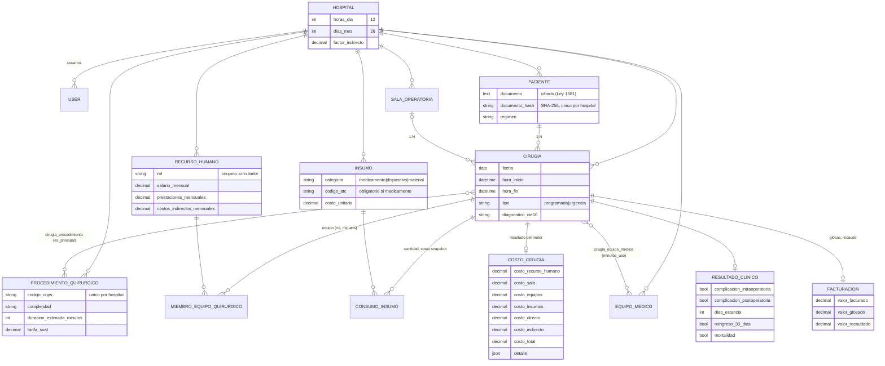

# Sistema de Costeo Quirúrgico (TDABC) — Capas 2 y 3

Aplicativo web del **Sistema de Gestión del Conocimiento para optimizar los costos del
servicio de cirugía** en hospitales de mediana complejidad (tesis doctoral, arquitectura
de Kerschberg). Este entregable implementa de forma completa:

- **Capa 2 — Datos**: modelo de datos multi-hospital (14 entidades de dominio),
  migraciones, modelos Eloquent, factories, seeders y validaciones automáticas.
- **Capa 3 — Información/BI**: motor de costeo **TDABC**, detección de **outliers**,
  KPIs bajo el marco **Donabedian** (estructura–proceso–resultado) expuestos como
  endpoints JSON, y 4 dashboards en React (Recharts).

**Stack**: Laravel 13 (starter kit React) · Inertia.js + React 19 · Tailwind 4 ·
Recharts · SQLite (desarrollo) / MySQL 8 (producción) · PHPUnit.

---

## Cómo levantar el proyecto

Requisitos: PHP ≥ 8.3, Composer, Node ≥ 20.

```bash
cd app-costeo

# 1. Dependencias
composer install
npm install

# 2. Entorno (por defecto usa SQLite, no requiere servidor de BD)
cp .env.example .env
php artisan key:generate

# 3. Esquema + datos de ejemplo (incluye la cesárea de referencia de $520.000)
php artisan migrate:fresh --seed

# 4. Frontend + servidor
npm run build          # o `npm run dev` para desarrollo con HMR
php artisan serve      # http://localhost:8000
```

**Usuarios de demostración** (contraseña: `password`):

| Correo | Hospital (tenant) |
|---|---|
| `admin@sanrafael.test` | Hospital San Rafael de Maicao `[SEMILLA]` — dataset completo (~38 cirugías) |
| `admin@riohacha.test` | Hospital Nuestra Señora de Riohacha `[SEMILLA]` — dataset pequeño, con factor de costos indirectos 12 % |

> Todos los datos sembrados son **ficticios** y están marcados con `[SEMILLA]`.
> Los códigos CUPS/ATC son de ejemplo, no oficiales.

Tras iniciar sesión, los dashboards están en el menú lateral o en `/costeo`.

### Usar MySQL 8 (producción)

Las migraciones son compatibles con MySQL 8. En `.env`:

```env
DB_CONNECTION=mysql
DB_HOST=127.0.0.1
DB_PORT=3306
DB_DATABASE=costeo_quirurgico
DB_USERNAME=usuario
DB_PASSWORD=secreto
```

y ejecutar `php artisan migrate:fresh --seed`.

---

## Cómo correr los tests

```bash
php artisan test
```

Estado actual: **61 tests, 227 aserciones, todos pasando** (incluye los tests de
auth del starter kit). También pasan `composer lint` (Pint) y `composer types:check`
(PHPStan/Larastan nivel 7).

Tests del dominio:

| Test | Qué verifica |
|---|---|
| `Unit/TdabcCostingServiceTest` | **Caso obligatorio de la tesis**: la cesárea da exactamente **$520.000 COP** (cirujano $50.000/h×1,5 h + ayudante $30.000×1,5 + anestesiólogo $50.000×2 + instrumentador $20.000×2 + circulante $15.000×2 + sala $40.000×2 + insumos $150.000). Además: derivación del costo/minuto, factor de indirectos y recálculo idempotente. |
| `Feature/DemoSeederTest` | El seeder reproduce la cesárea de $520.000 y crea dos hospitales con datos separados. |
| `Feature/TenantIsolationTest` | Un usuario solo ve/agrega datos de su hospital; una cirugía ajena responde 404. |
| `Feature/KpiEndpointsTest` | Valores exactos de costo promedio, CV, margen, glosas/recaudo, utilización de salas, completitud y detección de outliers. |
| `Feature/ValidacionesTest` | Consistencia temporal, CIE-10, CUPS, ATC obligatorio en medicamentos, unicidad de paciente por hash e integridad referencial entre hospitales. |

---

## Arquitectura

### Multi-tenant (BD única con `hospital_id`)

Cada tabla de dominio referencia `hospitales.id`. El trait
[`BelongsToHospital`](app/Models/Concerns/BelongsToHospital.php) aplica un
[`HospitalScope`](app/Models/Scopes/HospitalScope.php) global que **filtra toda
consulta** por el hospital activo y lo **asigna automáticamente al crear** registros.
El hospital activo se resuelve en [`HospitalContext`](app/Support/HospitalContext.php):
por defecto es el del usuario autenticado (`users.hospital_id`); seeders y tests pueden
fijarlo con `HospitalContext::set()`. El route-model-binding hereda el scope, así que
un recurso de otro hospital responde `404` sin código adicional.

### Motor TDABC — [`TdabcCostingService`](app/Services/Costing/TdabcCostingService.php)

```
costo total   = Σ(costo/minuto del recurso × minutos de uso) + costo de insumos
costo/minuto  = (salario + prestaciones + indirectos) ÷ minutos disponibles/mes
minutos disp. = horas_dia × dias_mes × 60      (12 × 26 × 60 = 18.720 por defecto)
```

- Sala y equipos médicos se costean por tarifa/hora prorrateada a minutos.
- `costo_indirecto = costo_directo × hospitales.factor_indirecto` (asignación adicional).
- El desglose línea a línea queda en `costos_cirugia.detalle` (JSON).

### Validaciones automáticas (Form Requests)

- **Completitud**: campos obligatorios por entidad.
- **Consistencia**: `hora_fin > hora_inicio`, CUPS de 6 dígitos, CIE-10
  (`O82`, `K35.8`), ATC obligatorio para medicamentos (`J01CA04`).
- **Integridad referencial**: las reglas `exists` se acotan al hospital del usuario
  (no se puede referenciar pacientes/salas/insumos de otro tenant) + FKs en BD.
- **Outliers**: [`OutlierDetector`](app/Services/Costing/OutlierDetector.php) combina
  z-score (|z| > 3) y Tukey (1,5 × IQR) por procedimiento.
- **Ley 1581/2012**: el documento del paciente se guarda **cifrado** (cast
  `encrypted`) con hash SHA-256 para búsqueda/unicidad; los KPIs solo devuelven
  agregados.

### Endpoints (sesión autenticada, prefijo `/api/v1`)

| Método | Ruta | KPI / acción |
|---|---|---|
| GET | `kpis/costos` | Costo promedio por cirugía y por procedimiento *(proceso)* |
| GET | `kpis/variabilidad` | Coeficiente de variación por procedimiento *(proceso)* |
| GET | `kpis/margen` | Costo real vs. tarifa facturada y referencia SOAT −25 % *(resultado)* |
| GET | `kpis/utilizacion-salas?mes=YYYY-MM` | Minutos operados ÷ disponibles por sala *(estructura)* |
| GET | `kpis/glosas-recaudo` | Tasas de glosas y recaudo *(resultado)* |
| GET | `kpis/completitud` | % de cirugías con equipo/insumos/costo/resultado/factura *(supervisión)* |
| GET | `kpis/outliers` | Costos atípicos por procedimiento (z + IQR) |
| GET | `kpis/componentes` | Costo promedio por componente TDABC |
| POST | `pacientes`, `insumos`, `procedimientos`, `recursos-humanos` | Captura con validación |
| POST | `cirugias` | Cirugía + procedimientos + equipo + consumos (transaccional) |
| POST | `cirugias/{id}/calcular-costo` | Ejecuta el motor TDABC |

### Dashboards (`/costeo`)

`/costeo` (resumen ejecutivo + completitud) · `/costeo/componentes` (barras apiladas
por componente TDABC) · `/costeo/outliers` (dispersión con límites estadísticos) ·
`/costeo/rentabilidad` (costo vs. tarifas + margen) · `/costeo/variabilidad` (CV por
procedimiento con umbrales 15 %/30 %).

> La autenticación es la del starter kit (Fortify) usada como **stub**; roles y
> permisos finos quedan fuera de este alcance.

---

## Modelo de datos



**Estándares**: CUPS (procedimientos), CIE-10 (diagnósticos), ATC (medicamentos).
Montos en `DECIMAL(14,2)` COP.

## Estructura relevante

```
app/
├── Enums/                       # RolQuirurgico, TipoCirugia, CategoriaInsumo, ...
├── Models/                      # 13 modelos de dominio + User
│   ├── Concerns/BelongsToHospital.php    # trait multi-tenant
│   └── Scopes/HospitalScope.php
├── Services/
│   ├── Costing/TdabcCostingService.php   # motor (Capa 3a)
│   ├── Costing/OutlierDetector.php       # z-score + IQR
│   └── Indicators/KpiService.php         # KPIs Donabedian (Capa 3b)
├── Http/Requests/               # validaciones automáticas
├── Http/Controllers/Api/V1/     # endpoints JSON
└── Support/                     # HospitalContext, Estadistica
database/
├── migrations/                  # 16 migraciones (14 tablas de dominio)
└── seeders/DemoSeeder.php       # 2 hospitales + cesárea de $520.000
resources/js/pages/costeo/       # dashboards Recharts (Capa 3c)
tests/                           # Unit + Feature del dominio
```

**Fuera de alcance** (fases posteriores): Capa 1 (repositorio documental), Capa 4
(comunidades/lecciones aprendidas), resto de Capa 5 y autenticación avanzada.
